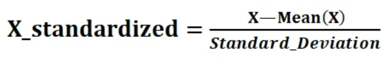
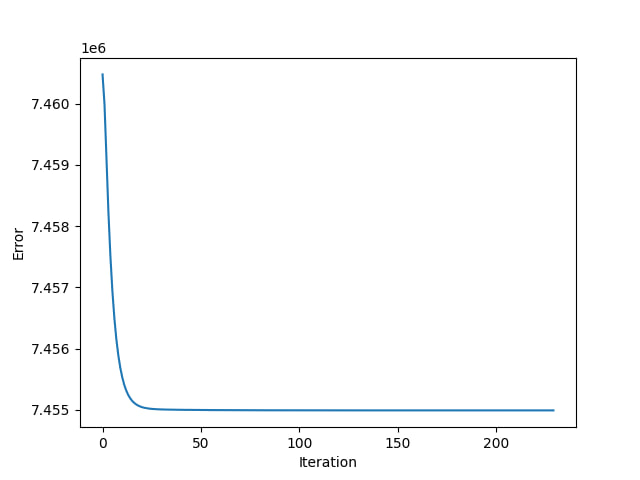
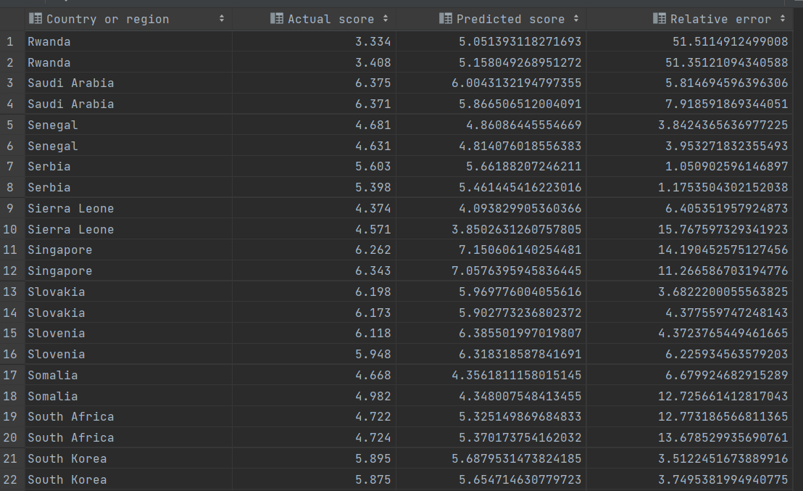

# linear regression for predicting happiness index

Predicting happiness index (subjective value) using measurable values like GDP, 
life expectancy, Freedom to make life choices, Social support, Generosity, Generosity etc.
Data were taken from Kaggle: https://www.kaggle.com/datasets/sougatapramanick/happiness-index-2018-2019

In this project, I used gradient descent with variable step size to find the best parameters for the model.

I also used the summ squared error (SSE) as the cost function.

---

During the execution of this university project, we will attempt to learn how to predict the value of the happiness index based on the parameters it includes, namely: GDP per capita (in thousands of US dollars), Social Support, Healthy Life Expectancy, Freedom to Make Life Choices, Generosity, and Perception of Corruption. In the context of this work, we are not concerned with how these components of the index are determined.

The dataset is available on the Kaggle platform: https://www.kaggle.com/datasets/sougatapramanick/happiness-index-2018-2019

The dataset consists of a total of 312 records, so achieving high accuracy is unlikely.

## Let's consider the chosen mathematical apparatus:

For the model, I have chosen linear regression:

    f(X) = w0 + w1 * x1 + w2 * x2 + w3 * x3 + w4 * x4 + w5 * x5 + w6 * x6

###### where wi – are the indices that we will try to bring as close as possible to the actual result.

We will also choose an error assessment function. It will be the sum of squared deviations, or Sum of Squared Errors (SSE):
    
    SSE(X, y) = Σ[(yi - f(xi))²]

We will minimize this function using the method of steepest gradient descent, where the step length will be determined using the Fibonacci method.

To minimize the objective function, it's evident that we need to determine its gradient:

    SSE(X) = Σ[(f(xi) - yi) * xi]

The input data was also standardized as follows:

Let's train the model:

To do this, we will divide the dataset into training and validation sets in a 3:4 ratio.

Gradient descent reached the minimum point in 10665 iterations with a precision of eps = 0.000001 and a maximum gradient step of 0.001.

    SSE(X) = 266.20 (initial SSE was 2210.88).

It's worth noting that regardless of the parameters, the error cannot go below this value (clearly, insufficient input data forces the model to hit a certain "accuracy wall"). This effect is visible on the graph:

As we can see, 20% of iterations cover the left portion of approximation. It's evident that if we were able to increase the dataset (for example, by including data from previous and subsequent years), we could significantly reduce the regression error.

#### Let's run test data to ensure that the model works:

As we can see, the model predicts the index values fairly well with an average relative error of 11.77%.

### Conclusions:
The research concludes that independent variables, namely GDP per capita, social support, healthy life expectancy, freedom to make life choices, and perception of corruption, significantly influence the Happiness Index in both 2018 and 2019. The findings suggest that policies and stakeholders can focus their attention on these variables to enhance overall well-being and happiness. The analysis also underscores the importance of GDP per capita and social support in determining the Happiness Index.